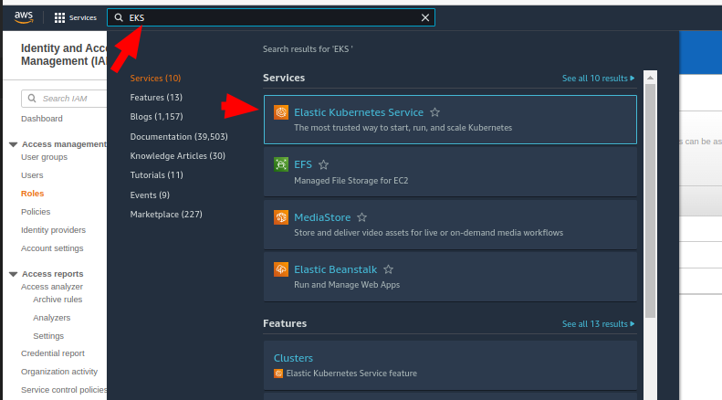

# Backup-kubernetes-cluster-resources
Welcome to Project 8, I hope you enjoyed and learned from previous projects. Today, I will walk you through backing kubernetes cluster resoures using Velero.
Organizations are adopting the use of containers to encapsulate their microservices, and many choose Kubernetes for automating deployment, scaling, and managing their containerized applications. As the number of these microservices grows, it becomes increasingly important to have a centralized backup mechanism in place. These help to

- Protect applications in case of physical and logical errors
- Perform migrations between Kubernetes clusters
- Replicate production clusters to development and testing environments.
Today, we will explore a backup tool called Velero.
<a href= "https://velero.io/">Velero</a> is an open-source backup and disaster recovery tool that makes it easy to perform backup and disaster recovery operations in Kubernetes. Velero offers disastery recovery, data migration and data protection capabalities. The diaster recovery reduces time to recovery in case of infrastructure loss, data corruption, and/or service outages while the data protection offers key data protection features such as scheduled backups, retention schedules, and pre or post-backup hooks for custom actions. The data migration 
while the data enables cluster portability by easily migrating Kubernetes resources from one cluster to another​.


AWS customers can leverage this solution to centrally back up and restore Kubernetes objects and applications from and to Amazon Elastic Kubernetes Service (Amazon EKS), our managed solution that helps you provide highly available and secure Kubernetes clusters and automates key tasks such as patching, node provisioning, and updates. This means that customers can also use Velero to migrate from self-hosted Kubernetes to Amazon EKS.
In this project, we will focus on how to use Velero to back up, restore, and migrate your Amazon EKS cluster resources and understand the backup options that Velero offers to decide which approach best suits your organization’s use case.
Velero and Amazon EKS
In this section, you will familiarize yourself with how Velero integrates with Amazon EKS, the customizations that this tool offers for backing up and restoring applications, and the backup-restore workflow.
An application-level backup in Amazon EKS targets two components:

- Kubernetes objects and configurations stored in the [etcd](https://kubernetes.io/docs/concepts/overview/components/#etcd) key/value store
- Application data stored in persistent volumes

In Amazon EKS, the etcd key/value store is managed by AWS and is only accessible through the Kubernetes API Server. Velero leverages the Kubernetes API to retrieve this data from the key/value store. This approach provides more flexibility than accessing etcd directly because with API calls, you can easily filter resources by namespace, resource type, or label. For example, you could limit the scope of your backups to a specific application, filtering by labels, or save your current RBAC strategy, filtering by object type.

Velero also takes snapshots of the cluster’s persistent volumes and restores them alongside the cluster’s objects (details in next section).

Backup and restore operations are declared as Kubernetes [Custom Resource Definition (CRD)](https://kubernetes.io/docs/concepts/extend-kubernetes/api-extension/custom-resources/#customresourcedefinitions) objects and are managed by controllers that process these new CRD objects to perform backups, restores, and all related operations. When creating these backup and restore CRD objects, you can specify the following customizations:

- *Filter resources*: restrict the scope of a backup or restore filtering by namespace, object type, or label. When restoring, you can also filter by excluding namespaces and object types.
- *Choose the backup type*: create on-demand backup or set schedules to initiate backups automatically at recurring intervals.
- *Set retention times*: indicate how long you want to retain backups.
- *Specify hooks*: configure pre- and post-hooks to run custom commands in containers before and after a backup or restore operation.

### Backup and restore workflow

Velero consists of two components:

- A *Velero server* pod that runs in your Amazon EKS cluster
- A command-line client (*Velero CLI*) that runs locally

Whenever we issue a backup against an Amazon EKS cluster, Velero performs a backup of cluster resources in the following way:

1. The Velero CLI makes a call to the Kubernetes API server to create a backup CRD object.
2. The backup controller:
    1. Checks the scope of the backup CRD object, namely if we set filters.
    2. Queries the API server for the resources that need a backup.
    3. Compresses the retrieved Kubernetes objects into a .tar file and saves it in [Amazon S3](https://aws.amazon.com/s3/).
    
    Similarly, whenever we issue a restore operation:

1. The Velero CLI makes a call to Kubernetes API server to create a restore CRD that will restore from an existing backup.
2. The restore controller:
    1. Validates the restore CRD object.
    2. Makes a call to Amazon S3 to retrieve backup files.
    3. Initiates restore operation.
     

Velero also performs backup and restore of any persistent volume in scope:

1. If you are using [Amazon Elastic Block Store (Amazon EBS)](https://aws.amazon.com/ebs/), Velero will create Amazon EBS snapshots of persistent volumes in scope.
2. For any other volume type (except hostPath), use Velero’s [Restic](https://velero.io/docs/v1.6/restic/) integration to take file-level backups of the contents of your volumes. At the time of writing, Restic is in Beta, and therefore not recommended for production-grade backups.

Now that we have a background knowledge of Velero,EKS. Lets get our hands dirty!!!!

### Project Prerequisites

To be able to follow along with the next steps, you will need to have the following installed:

- 
eksctl
  See [Installing or upgrading eksctl](https://docs.aws.amazon.com/eks/latest/userguide/eksctl.html#installing-eksctl).


- Two EKS clusters in the same AWS account. See [Creating an EKS Cluster](https://docs.aws.amazon.com/eks/latest/userguide/create-cluster.html). 
    - The two clusters will be referred to as the 
    Primary
     and 
    Recovery
     clusters.
    - Each cluster must be configured with an EKS IAM OIDC Provider. See [Create an IAM OIDC provider for your cluster](https://docs.aws.amazon.com/eks/latest/userguide/enable-iam-roles-for-service-accounts.html). This is a requirement for [IAM roles for service account](https://docs.aws.amazon.com/eks/latest/userguide/iam-roles-for-service-accounts.html) which is used to grant the required AWS permissions to the Velero deployments.

Here is how I created my EKS cluster, you can follow along
## Step 1 : Create an EKS role
a. I logged into my AWS account and searched for IAM

b. I selected to "Role" on the left bar of the dashboard and selected "Create role".


c. On the "Select trusted entity" page,I selected AWS service as trusted entity and from the drop down under use cases for other AWS services, I searched for EKS, selected EKS - Cluster and then select Next.


*** Overview of all that was selected** 

d. On the Add permissions page, the AmazonEKSClusterPolicy is added by default. I used the default settings and select Next.

e. On the "Name, review and create" page,you can give your role a name, I gave mine "EKSCLUSTER" you may add a description (This is optional). Scroll to the bottom of the page and select "Create role".


f. I  navigated to all the Roles and I found the newly created role.


## Step 2 - Cluster Creation
a. To create the cluster,I searched for EKS in the search box then selected Elastic Kubernetes Service from the options that popped up.


b.I selected "Add cluster" and the "select create".

c. On the Configure cluster page, I used the following credentials:

Name - type the cluster name Primary.

Cluster Service Role - I selected the EKS role create

Then I left the default setting for everything else and clicked Next
d. On the Specify networking page, I chose my subnet. Three subnets is a good amount,I used the default settings for everything else and clicked Next.


e. I clicked Next on the Configure logging page(Did not change any configuration here)

 and on the Review and create page, I clicked Create.
 
f. ***It took a few minutes for the cluster to be created**. I navigated to clusters on the left bar under Amazon EKS.Once your cluster is created, the status will be Active.
 Please repeat the above steps for the second cluster and name Recovery. Below are my snapshot for Recovery Cluster


- AWS CLI version 2. See [Installing, updating, and uninstalling the AWS CLI version 2](https://docs.aws.amazon.com/cli/latest/userguide/install-cliv2.html).


Configure EKS IAM OIDC Provider
View your OIDC provider URL


$ aws eks describe-cluster --name my-cluster --query "cluster.identity.oidc.issuer" --output text


$  eksctl utils associate-iam-oidc-provider --cluster my-cluster --approve


Create an IAM OIDC identity provider:


$ eksctl utils associate-iam-oidc-provider --cluster my-cluster --approve


~$  eksctl utils associate-iam-oidc-provider --cluster Recovery  --approve

To verify and list the IAM OIDC providers in your account. Replace EXAMPLED539D4633E53DE1B716D3041E with the value returned from the first command i.e from 
$  aws eks describe-cluster --name Primary --query "cluster.identity.oidc.issuer" --output text


$ aws iam list-open-id-connect-providers | grep EXAMPLED539D4633E53DE1B716D3041E


$ aws iam list-open-id-connect-providers | grep 3B766E8428CB9EC7A240C60A693C069E


- Helm v3. See [Installing Helm](https://helm.sh/docs/intro/install/).


- 
kubectl
. See [Installing kubectl](https://docs.aws.amazon.com/eks/latest/userguide/install-kubectl.html).


*** The two EKS clusters we used for this walkthrough are in the same account, but this is not a hard requirement for using Velero. In this case, you can still use this project as a guideline and adjust IAM and S3 bucket permissions accordingly***

Notice that the commands in the following sections are written in Bash.

We have completed the prerequsite installation, Lets get started with the project!!!!

### Install Velero

We will be using EKS best practices to install Velero.
First, we will create an S3 bucket to store the backups. We will then use [IAM roles for service accounts](https://docs.aws.amazon.com/eks/latest/userguide/iam-roles-for-service-accounts.html) to grant Velero necessary AWS permissions to perform backup and restore operations. Lastly, we will install the Velero CLI to simplify how we interact with this tool.

### Step 1: Create an S3 Bucket to store backups

Velero uses S3 to store EKS backups when running in AWS.
We will run the following command to create an S3 bucket for Velero. Be sure to use a unique bucket name like 
<company-fqdn>-eks-velero-backups
.

Replace 
<BUCKETNAME>
 and
<REGION>
 with your own values below.


bash
Replace <BUCKETNAME> and <REGION> with your own values below.
BUCKET=<BUCKETNAME>
REGION=<REGION>
aws s3 mb s3://$BUCKET --region $REGION


Although Amazon S3 stores your data across multiple geographically distant [Availability Zones](https://aws.amazon.com/about-aws/global-infrastructure/regions_az/#Availability_Zones) by default, compliance requirements might dictate that you store data at even greater distances. [Cross-Region Replication](https://docs.aws.amazon.com/AmazonS3/latest/userguide/replication-how-setup.html) allows you to replicate data between distant AWS Regions to satisfy these requirements.

Run:

$ BUCKET=<BUCKETNAME>
Then:

$ REGION=<REGION>
Finally:

$ aws s3 mb s3://$BUCKET --region $REGION
Example:

BUCKET= myquad-eks-velero-backup

REGION=us-east-1

aws s3 mb s3://$BUCKET --region $REGION


If you navigate to S3 in your amazon account, you should see that the bucket has been created.Look at mine below


### Creating IAM Policy

Velero performs a number of API calls to resources in EC2 and S3 to perform snapshots and save the backup to the S3 bucket. The following IAM policy will grant Velero the necessary permissions.
nano velero_policy.json 


{
    "Version": "2012-10-17",
    "Statement": [
        {
            "Effect": "Allow",
            "Action": [
                "ec2:DescribeVolumes",
                "ec2:DescribeSnapshots",
                "ec2:CreateTags",
                "ec2:CreateVolume",
                "ec2:CreateSnapshot",
                "ec2:DeleteSnapshot"
            ],
            "Resource": "*"
        },
        {
            "Effect": "Allow",
            "Action": [
                "s3:GetObject",
                "s3:DeleteObject",
                "s3:PutObject",
                "s3:AbortMultipartUpload",
                "s3:ListMultipartUploadParts"
            ],
            "Resource": [
                "arn:aws:s3:::${BUCKET}/*"
            ]
        },
        {
            "Effect": "Allow",
            "Action": [
                "s3:ListBucket"
            ],
            "Resource": [
                "arn:aws:s3:::${BUCKET}"
            ]
        }
    ]
}


aws iam create-policy \
    --policy-name VeleroAccessPolicy \
    --policy-document file://velero_policy.json

### Create Service Accounts for Velero

The best practice for providing AWS policies to applications running on EKS clusters is to use [IAM Roles for Service Accounts](https://docs.aws.amazon.com/eks/latest/userguide/iam-roles-for-service-accounts.html). eksctl provides an easy way to create the required IAM role and scope the trust relationship to the velero-server Service Account.

Replace 
<CLUSTERNAME>
 with the name of your 
Primary
 and 
Recovery
 EKS cluster.

bash
PRIMARY_CLUSTER=<CLUSTERNAME>
RECOVERY_CLUSTER=<CLUSTERNAME>
ACCOUNT=$(aws sts get-caller-identity --query Account --output text)

eksctl create iamserviceaccount \
--cluster=$PRIMARY_CLUSTER \
--name=velero-server \
--namespace=velero \
--role-name=eks-velero-backup \
--role-only \
--attach-policy-arn=arn:aws:iam::$ACCOUNT:policy/VeleroAccessPolicy \
--approve

eksctl create iamserviceaccount \
--cluster=$RECOVERY_CLUSTER \
--name=velero-server \
--namespace=velero \
--role-name=eks-velero-recovery \
--role-only \
--attach-policy-arn=arn:aws:iam::$ACCOUNT:policy/VeleroAccessPolicy \
--approve


The 
--namespace=velero
 flag ensures that only an application running in the 
velero
 namespace will be able to access the IAM Policy created in the previous step.

Run:

$ PRIMARY_CLUSTER=<CLUSTERNAME>
PRIMARY_CLUSTER=Primary

Followed by:

$ RECOVERY_CLUSTER=<CLUSTERNAME>
RECOVERY_CLUSTER=Recovery

Then:

$  ACCOUNT=$(aws sts get-caller-identity --query Account --output text)
Run the below command to create service account for primary  & recovery clusters:
eksctl create iamserviceaccount \
--cluster=$PRIMARY_CLUSTER \
--name=velero-server \
--namespace=velero \
--role-name=eks-velero-backup \
--role-only \
--attach-policy-arn=arn:aws:iam::$ACCOUNT:policy/VeleroAccessPolicy \
--approve

eksctl create iamserviceaccount \
--cluster=$RECOVERY_CLUSTER \
--name=velero-server \
--namespace=velero \
--role-name=eks-velero-recovery \
--role-only \
--attach-policy-arn=arn:aws:iam::$ACCOUNT:policy/VeleroAccessPolicy \
--approve


### Install Velero in both EKS Clusters

The instructions below include the necessary steps to install Velero using the Helm chart.
```
helm repo add vmware-tanzu https://vmware-tanzu.github.io/helm-charts
````


Next, we will create two .yaml files; values.yaml and values_recovery.yaml. 
## First File


cat > values.yaml <<EOF
configuration:
  backupStorageLocation:
    bucket: $BUCKET(insert name of bucket)
  provider: aws
  volumeSnapshotLocation:
    config:
      region: $REGION (insert name of region)
credentials:
  useSecret: false
initContainers:
- name: velero-plugin-for-aws
  image: velero/velero-plugin-for-aws:v1.2.0
  volumeMounts:
  - mountPath: /target
    name: plugins
serviceAccount:
  server:
    annotations:
      eks.amazonaws.com/role-arn: "arn:aws:iam::${ACCOUNT}:role/eks-velero-backup"
EOF
Second File
cat > values_recovery.yaml <<EOF
configuration:
  backupStorageLocation:
    bucket: $BUCKET
  provider: aws
  volumeSnapshotLocation:
    config:
      region: $REGION
credentials:
  useSecret: false
initContainers:
- name: velero-plugin-for-aws
  image: velero/velero-plugin-for-aws:v1.2.0
  volumeMounts:
  - mountPath: /target
    name: plugins
serviceAccount:
  server:
    annotations:
      eks.amazonaws.com/role-arn: "arn:aws:iam::${ACCOUNT}:role/eks-velero-recovery"
EOF


or use nano  values.yaml to create the file


We need to install the Velero server twice: once in the 
Primary cluster and again in the 
Recovery cluster. You can use 
kubectl config ([kubectl cheat sheet](https://kubernetes.io/docs/reference/kubectl/cheatsheet/#kubectl-context-and-configuration)) or [kubectx](https://github.com/ahmetb/kubectx) to view the contexts for both clusters and easily switch contexts.

For easier management of 
kubectl config, we add our clusters to 
kubeconfig with an alias:

```PRIMARY_CONTEXT=<CONTEXTNAME>```
```RECOVERY_CONTEXT=<CONTEXTNAME>```

```aws eks --region $REGION update-kubeconfig --name```
$PRIMARY_CLUSTER --alias $PRIMARY_CONTEXT
aws eks --region $REGION update-kubeconfig --name $RECOVERY_CLUSTER --alias $RECOVERY_CONTEXT

PRIMARY_CONTEXT=Primary

RECOVERY_CONTEXT=Recovery

aws eks --region $REGION update-kubeconfig --name $RECOVERY_CLUSTER --alias $RECOVERY_CONTEXT


We can check that we have these new contexts with the following command:


kubectl config get-contexts


The “*” indicates which is the context we are in.
To change the context to `Primary` cluster and install Velero, we use the command:

```
kubectl config use-context $PRIMARY_CONTEXT

helm install velero vmware-tanzu/velero \
    --create-namespace \
    --namespace velero \
    -f values.yaml

```

To change the context to the `Recovery` cluster and install Velero:

```
kubectl config use-context $RECOVERY_CONTEXT

helm install velero vmware-tanzu/velero \
    --create-namespace \
    --namespace velero \
    -f values_recovery.yaml

```

We can check that the Velero server was successfully installed by running this command in each context:

`kubectl get pod –n velero`


### Install the Velero CLI

Velero operates by submitting commands as CRDs. To take a backup of the cluster, you submit to the cluster a backup CRD. These can be difficult to create by hand, so the Velero team has created a CLI that makes it easy to perform backups and restores. We will be using the Velero CLI to create a backup of the `Primary` cluster and restore to the `Recovery` cluster.

Installation instructions vary depending on your operating system. Follow the instructions to install Velero [here](https://velero.io/docs/v1.6/basic-install/#install-the-cli).
if using Linux, you can use the below commands 
```
$ wget https://github.com/vmware-tanzu/velero/releases/download/v1.8.1/velero-v1.8.1-linux-amd64.tar.gz
```
Extract tarball:
```
$ tar -zxvf velero-v1.8.1-linux-amd64.tar.gz
```
Move the extracted binary:
```
$ sudo mv velero-v1.8.1-linux-amd64/velero /usr/local/bin/
```

### Backup and restore an example application

With Velero installed, we will move forward with installing an application in our `Primary` cluster that we will back up and restore in our `Recovery` cluster. Customers will be able to follow the steps below to back up and restore their own applications in their own Amazon EKS clusters as well.

### Install Ghost app (and create a post)

Ghost will serve as our sample application that we will back up on the `Primary` cluster and restore to the `Recovery` cluster. We will use the [Bitnami Helm chart](https://github.com/bitnami/charts/tree/master/bitnami/ghost) as it’s commonly deployed and well-tested. This chart depends on the [Bitnami MariaDB chart](https://github.com/bitnami/charts/tree/master/bitnami/mariadb) that will serve as the persistent data store for the blog application. The MariaDB data will be stored in an EBS volume that will be snapshotted by Velero as part of performing the backup.

Now we switch to the `Primary` cluster’s context and install Ghost (ignore the notification *ERROR: you did not provide an external host* that appears when you install Ghost. This will be solved with the following commands):

```
helm repo add bitnami https://charts.bitnami.com/bitnami
````
We now switch the context:
kubectl config use-context $PRIMARY_CONTEXT

To install ghost 
```
helm install ghost bitnami/ghost \
    --create-namespace \
    --namespace ghost
export APP_HOST=$(kubectl get svc --namespace ghost ghost --template "{{ range (index .status.loadBalancer.ingress 0) }}{{ . }}{{ end }}")export GHOST_PASSWORD=$(kubectl get secret --namespace "ghost" ghost -o jsonpath="{.data.ghost-password}" | base64 --decode)export MARIADB_ROOT_PASSWORD=$(kubectl get secret --namespace "ghost" ghost-mariadb -o jsonpath="{.data.mariadb-root-password}" | base64 --decode)export MARIADB_PASSWORD=$(kubectl get secret --namespace "ghost" ghost-mariadb -o jsonpath="{.data.mariadb-password}" | base64 --decode)
helm upgrade ghost bitnami/ghost \
  --namespace ghost \
  --set service.type=LoadBalancer \
  --set ghostHost=$APP_HOST \
  --set ghostPassword=$GHOST_PASSWORD \
  --set mariadb.auth.rootPassword=$MARIADB_ROOT_PASSWORD \
  --set mariadb.auth.password=$MARIADB_PASSWORD
```


We can check that the install was successful by running this command:

`kubectl get pod –n ghost`

### Create a blog post to demonstrate backup and restore of persistent volume

After the Helm chart installation is complete, the Chart README will be displayed in the console. It includes:

1. The Blog URL
2. The Admin URL
3. The default admin username
4. Instructions to use kubectl to retrieve the password


In order to create a blog post, sign in to the Ghost Admin console using the Admin URL provided.


You can optionally sign in to the Ghost Admin console (using the Admin URL displayed above) and create an example blog post that will be included in the backup and restore process. This will demonstrate that the backup includes not only the application deployment configuration but also the state of the blog database, which includes all of the posts.

To create a post, first select **Posts** in the left-hand navigation pane.


Then select New Post in the top right-hand corner of the page.


You can add a post title and write some content. When you are ready to save your sample blog post, select the **Publish** dropdown menu item in the top right corner of the page and then choose the **Publish** button in the dropdown.

To view your blog with your newly added content, open a new browser tab and enter the blog URL. You will see the Ghost blog with the default theme along with your new blog post and a few other sample blogs that present in the default installation.


### To Create Backup

Create a backup of the `Primary` cluster. Be sure to switch your `kubectl` context back to the `Primary` cluster before running the command below.

```
velero backup create ghost-backup
```

We can see how a Velero backup CRD looks like by using the `-o` flag, which outputs the backup CRD YAML without actually submitting the backup creation to the Velero server.
velero backup create test -o yaml
n the backup CRD, you can see that we are backing up all namespaces as the `includedNamespaces` array includes the star wildcard. Even though we are backing up the entire cluster, we can choose individual components of the cluster by using selectors. This gives us the ability to back up a single namespace, which may include a single application, for example.

### Validate that the backup was successful

Let’s check on the status of the backup and validate that the backup has been completed successfully.

`velero backup describe ghost-backup`

Look for the field `Phase:` in the output of the command. If the current `Phase` is `InProgress`, then wait a few moments and try again until you see the `Phase: Completed`. You can see additional details of the backup, including information such as the start time and completion time, along with the number of items backed up.
We can also see the backup files created by Velero in the Amazon S3 bucket we previously created:

`aws s3 ls $BUCKET/backups/ghost-backup/`
### Restore the application into the Recovery cluster

Switch your `kubectl` context to your Recovery cluster.

`kubectl config use-context $RECOVERY_CONTEXT`

Use the following command to restore only the Ghost application into the `Recovery` cluster.

### Validate the restore was successful

Let’s check on the status of the restore and validate that the restore has been completed successfully.

`velero restore describe ghost-restore`

Look for `Phase: Completed` in the output. If you see `Phase: InProgress`, then wait a few moments and run the command again. Then retrieve the URL of the LoadBalancer for the Ghost blog in the `Recovery` cluster:

`kubectl -n ghost get svc ghost`

Verify your blog has been restored by visiting the URL under `EXTERNAL-IP`. You should see the Ghost blog along with any example blog posts you created in previous steps.

Congratulations! You just successfully backed up your `Primary` cluster and restored your application in the `Recovery` cluster.

Notice that for your production backup/restore/DR operation, this is the point where you’d want to move your prod DNS records to point to the `Recovery` cluster, after validating that the service is working as expected.

## Cleaning up

To avoid incurring future charges, delete the resources. If you used `eksctl` to create your clusters, you can use `eksctl delete cluster <clustername>` to delete the clusters.

We also need to delete the S3 bucket that we used to store our backup and the IAM role used by Velero.

```bash
aws s3 rb s3://$BUCKET --force
aws iam delete-policy --policy-arn
arn:aws:iam::$ACCOUNT:policy/VeleroAccessPolicy
```

## Conclusion

There are a few different disaster recovery and migration strategies. In this project, we showed how Velero ensures quick recovery from failures and disaster events as well as seamless migrations for applications and cluster resources in Amazon EKS. We highlighted the options that this tool offers and showed the process of backing up and restoring to a new cluster a stateful application. Similarly, customers can also migrate, replicate their own applications and Kubernetes resources to other Amazon EKS clusters, or restore previous application states.

This approach enables you to centralize operations for disaster recovery or migration events as opposed to simply redirecting the CI/CD pipeline to deploy into the new EKS cluster. This is because CI/CD pipelines used to deploy and update applications in Kubernetes may perform actions that are not needed in these situations; moreover, one has to think about a separate approach to deal with data persistence. An alternative could be to create a specific CI/CD pipeline for such events.

In the case of self-managed Kubernetes clusters, customers can also use this open-source tool for a migration to Amazon EKS. 

